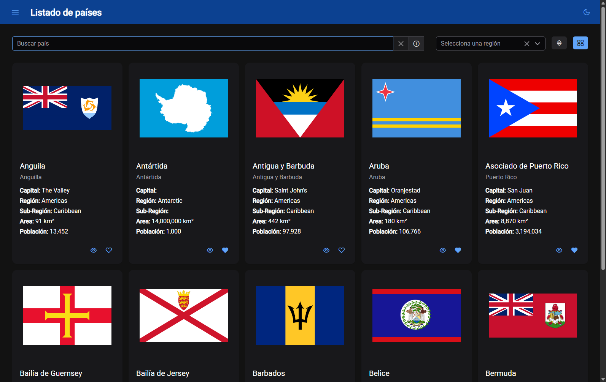
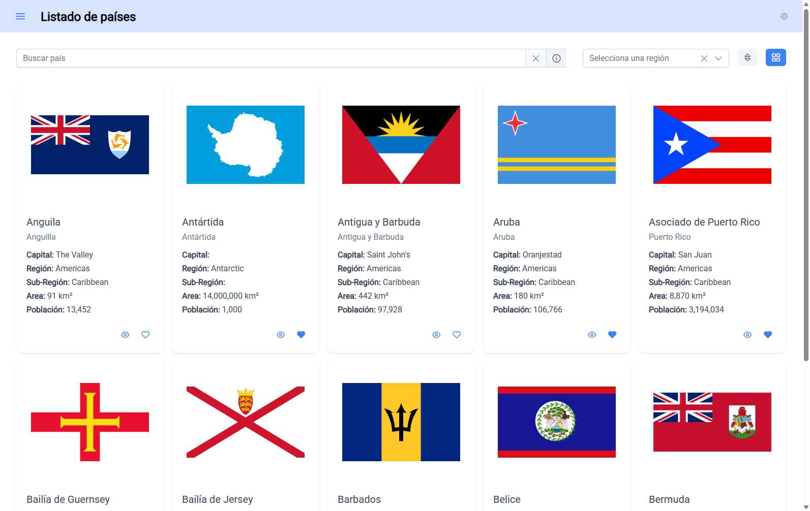
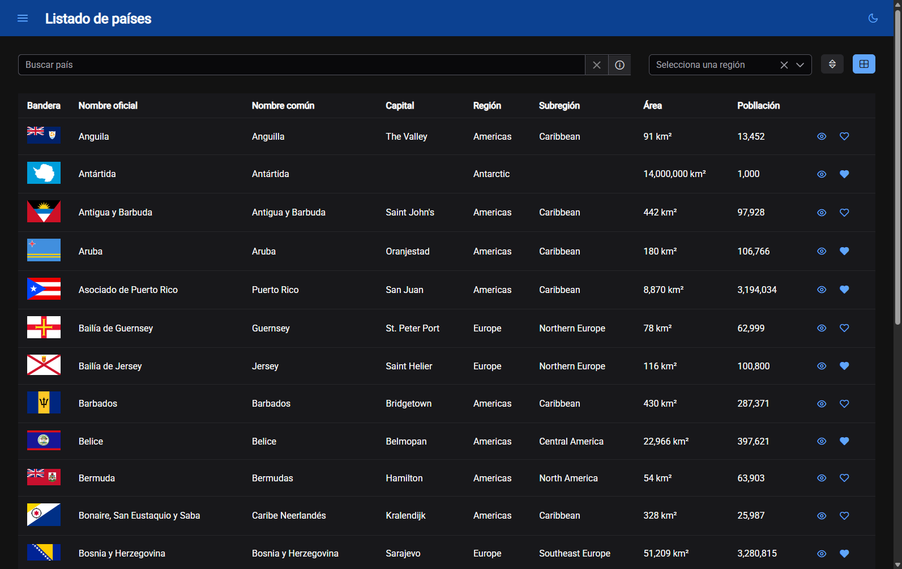
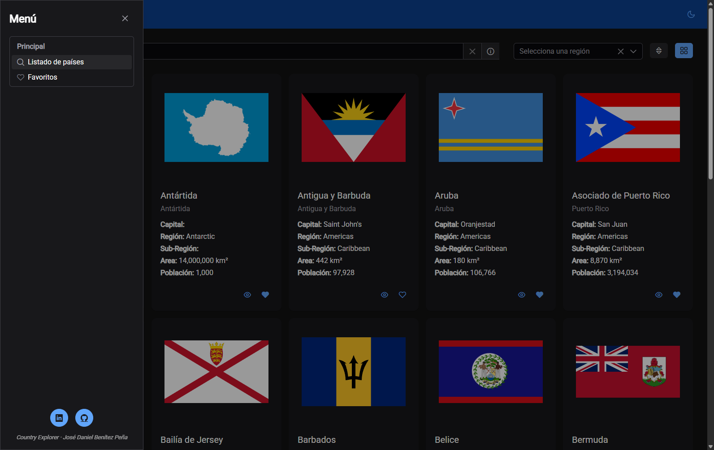
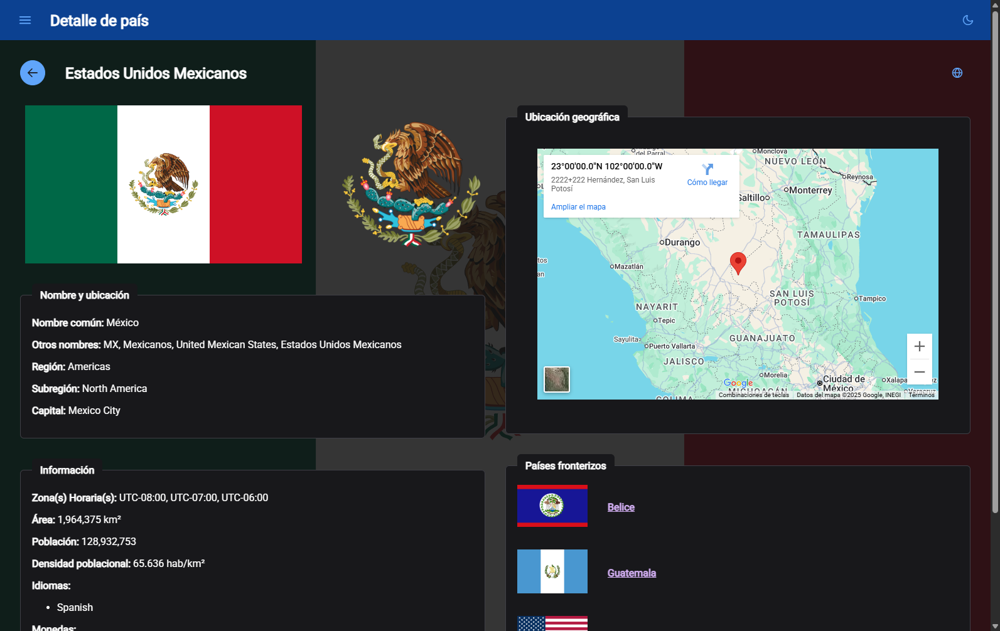
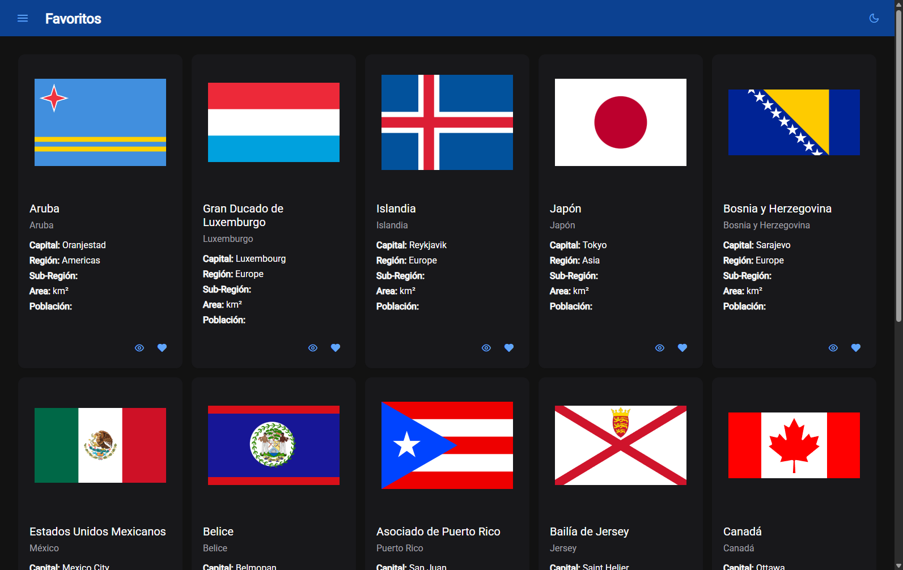

# 🌍 Country Explorer

Aplicación desarrollada en **Angular v19** para explorar información sobre los países de todo el mundo.

---

## ✨ Características principales

**General**
- Tema claro y oscuro
- Diseño responsivo para diferentes pantallas

**Listado de países con información básica**
- Búsqueda por **nombre**, **capital** o **región**
- Filtros por región (África, América, Asia, Europa, Oceanía y Antártida)
- Ordenamiento por nombre, capital, área o población
- Vista en **tarjetas** o en **tabla**
- **Carga diferida** usando *IntersectionObserver* para mejorar el rendimiento
- Botón para **agregar o quitar países de favoritos**

**Favoritos**
- Visualiza directamente todos los países guardados como favoritos

**Vista detallada del país seleccionado**
- Accede a toda la información proporcionada por la API https://restcountries.com

---

## ▶️ Cómo ejecutar la aplicación

```bash
  npm install
  ng serve -o
```

---

## 📸 Capturas de pantalla







